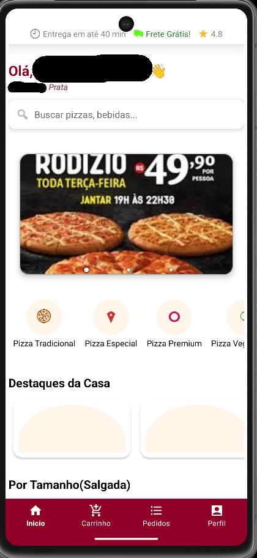
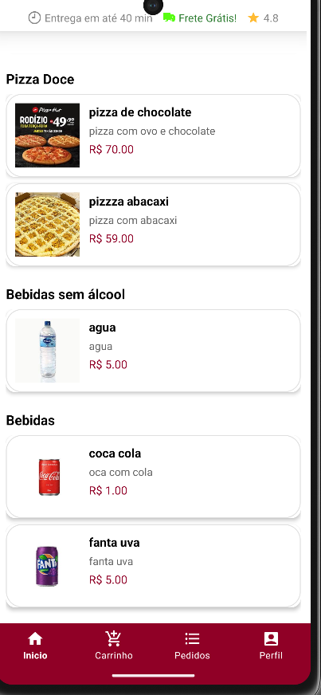
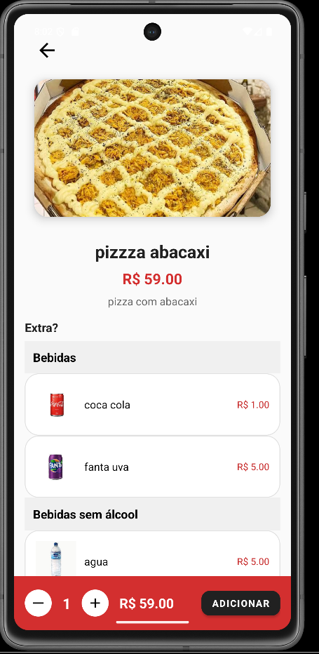
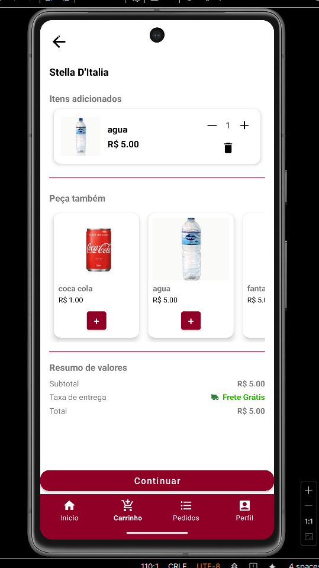
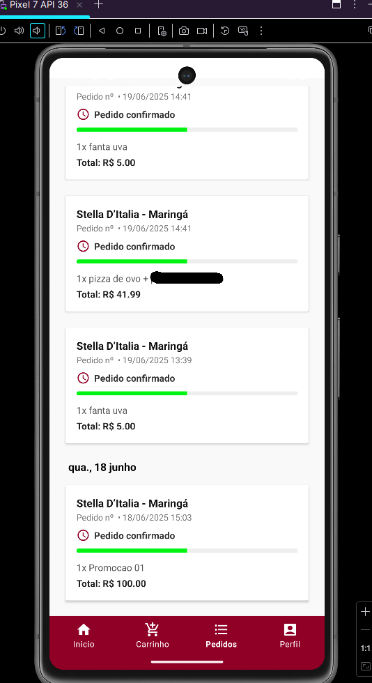
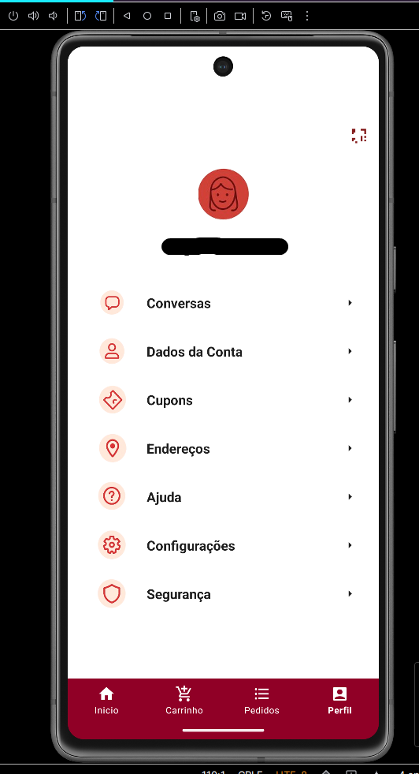

# Stella D'Italia - App Cliente


Aplicativo Android para clientes da pizzaria Stella D'Italia, com fluxo de cardapio, pedidos, carrinho, perfil e recursos de atendimento ao usuario.

O projeto foi desenvolvido em Kotlin e Android nativo, usando Firebase para autenticacao/dados, bibliotecas AndroidX e uma interface focada em compra e acompanhamento de pedidos.

## Screenshots

| | | |
| --- | --- | --- |
|  |  |  |
|  |  |  |

## Funcionalidades

- Login e cadastro de cliente.
- Cardapio com produtos da pizzaria.
- Carrinho e fluxo de pedido.
- Perfil do usuario.
- Integracao com Firebase.
- Recursos de localizacao, mapas e imagens.

## Tecnologias

- Kotlin
- Android Views/XML
- ViewBinding
- Firebase Auth
- Firebase Realtime Database
- Cloud Firestore
- Firebase Storage
- Firebase Functions
- Room
- Retrofit
- Glide e Picasso
- Google Maps e Location Services
- ZXing para leitura de codigo

## Como executar

### Pre-requisitos

- Android Studio
- JDK 21
- Projeto Firebase configurado

### Build local

```bash
git clone https://github.com/Crofolt/Stella-Cliente.git
cd Stella-Cliente
./gradlew assembleDebug
```

No Windows:

```powershell
.\gradlew.bat assembleDebug
```

## Configuracao local

O app usa Firebase e espera o arquivo local `app/google-services.json`, que nao deve ser versionado por seguranca.

## Autor

Projeto Android do app cliente da Stella D'Italia.
