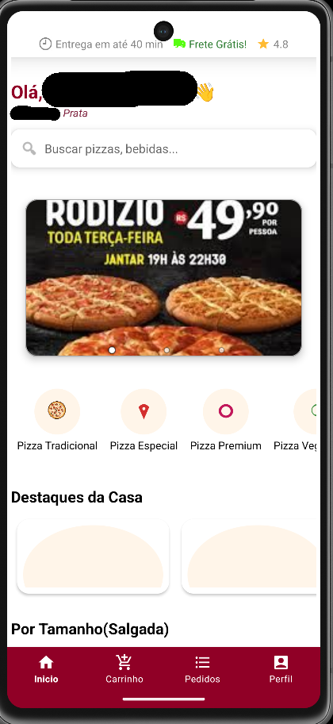
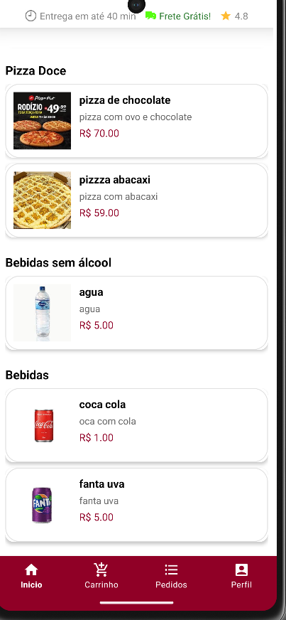
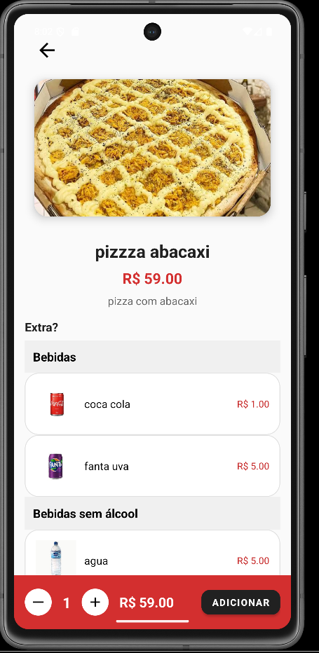
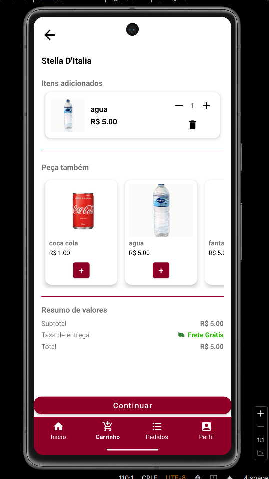
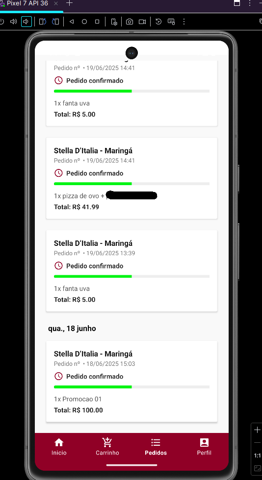
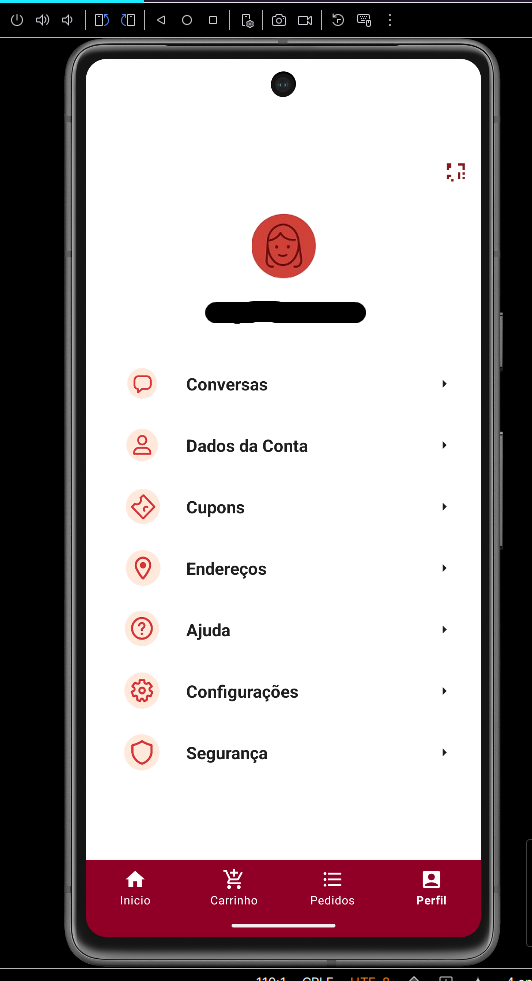

# Stella D'Italia — App Cliente

Aplicativo Android nativo voltado para a experiência de compra do cliente da Stella D'Italia, com fluxo de catálogo, produto, carrinho, pedidos e perfil.


## Visão geral

O projeto foi desenvolvido em **Kotlin + Android nativo**, com integração ao ecossistema Firebase e uma interface focada em navegação simples, descoberta de produtos e acompanhamento da jornada de compra.

## Screenshots

| | | |
| --- | --- | --- |
|  |  |  |
|  |  |  |

## Principais recursos

- autenticação e cadastro de cliente;
- catálogo/cardápio de produtos;
- detalhe de produto;
- carrinho e fluxo de pedido;
- perfil do usuário;
- integração com Firebase;
- recursos de localização, mapas e imagens;
- persistência local e comunicação com serviços externos.

## Tecnologias

- Kotlin
- Android Views / XML
- ViewBinding
- Firebase Authentication
- Firebase Realtime Database
- Cloud Firestore
- Firebase Storage
- Firebase Functions
- Room
- Retrofit
- Glide / Picasso
- Google Maps / Location Services
- ZXing

## Executar localmente

### Pré-requisitos

- Android Studio
- JDK 21
- projeto Firebase configurado

```bash
git clone https://github.com/perin-dv/Stella-Cliente.git
cd Stella-Cliente
./gradlew assembleDebug
```

No Windows:

```powershell
.\gradlew.bat assembleDebug
```

O arquivo `app/google-services.json` é específico do ambiente Firebase e não deve conter credenciais públicas.

## Projeto relacionado

- [Stella Empresa](https://github.com/perin-dv/Stella-Empresa)
- [Portfólio de Guilherme Perin](https://guilherme-perin.vercel.app)

## Autor

**Guilherme Perin**  
Software • IA • Cloud • Automação
